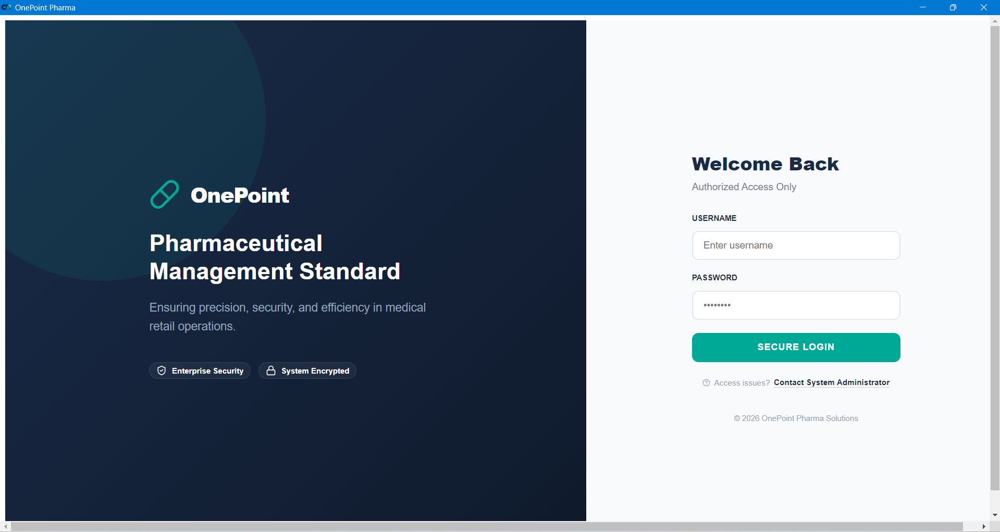
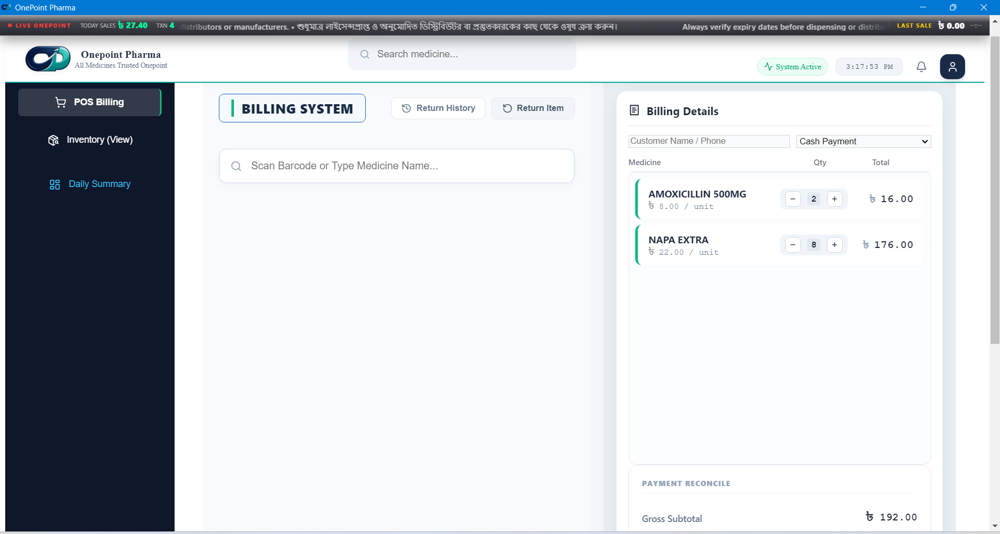
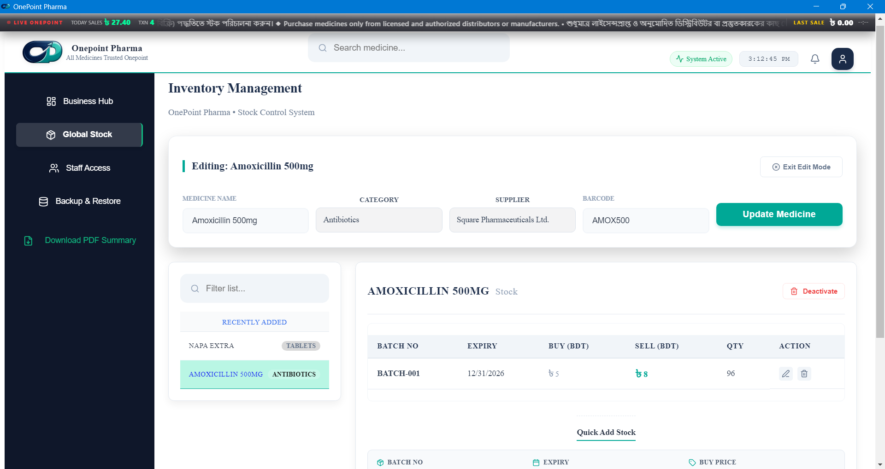
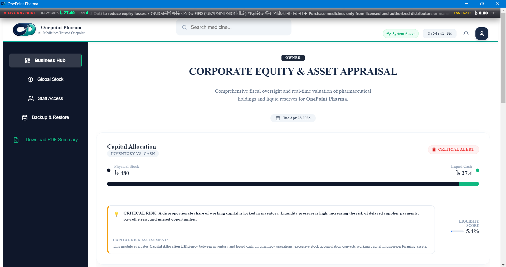

# 💊 OnePoint Pharma - POS & Pharmacy Management System

🚀 A full-featured desktop-based Pharmacy POS system built with Electron, React, Node.js, and PostgreSQL.

Designed for real-world pharmacy operations including billing, inventory, staff control, and reporting.

---

## 🖥️ System Overview

- 💻 Desktop Application (Electron)
- ⚡ Fast POS Billing System
- 📦 Inventory & Stock Management
- 👨‍⚕️ Role-Based Dashboard (Admin, Owner, Pharmacist)
- 🧾 Thermal & PDF Invoice Printing
- 🔄 Backup & Restore System
- 📊 Real-Time Reports & Analytics

---

## 🛠️ Tech Stack

**Frontend:**
- React.js (Vite)
- CSS (Custom UI)

**Backend:**
- Node.js
- Express.js

**Database:**
- PostgreSQL
- Prisma ORM

**Desktop App:**
- Electron.js

---

## 📸 Application Screenshots

### 🔐 Login Interface


---

### 💻 POS Billing System


---

### 📦 Inventory Management


---

### 👑 Owner Dashboard



## 🔥 Key Features

- Barcode-based fast billing
- Automatic stock update after sale
- Low stock alert system
- Role-based secure authentication
- Refund & return system
- Real-time dashboard analytics
- Offline-first desktop support

---

## ⚙️ Installation Guide

```bash
# Clone repository
git clone https://github.com/milons2/onepoint-pharma.git

# Install dependencies
npm install

# Setup database
npx prisma migrate dev
npx prisma db seed

# Run backend
node src/server.js

# Run frontend
cd pos-ui
npm install
npm run dev

# Run Electron app
npm run electron

👨‍💻 Developer

Jibanur Sarker
💼 Computer Engineer
📧 milons420@yahoo.com

🎯 Project Purpose
This system is designed to solve real pharmacy business problems:

Manual billing errors
Inventory mismanagement
Lack of reporting systems

⭐ Why This Project Stands Out
Real-world production-level architecture
Multi-role authentication system
Desktop + Web hybrid system
Complete pharmacy workflow automation

📌 Future Improvements
Cloud sync system
Mobile app integration
Online payment integration (bKash/Nagad)
Multi-branch support
