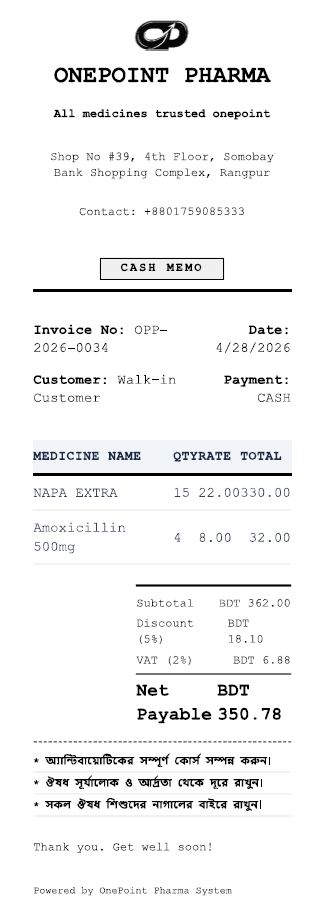
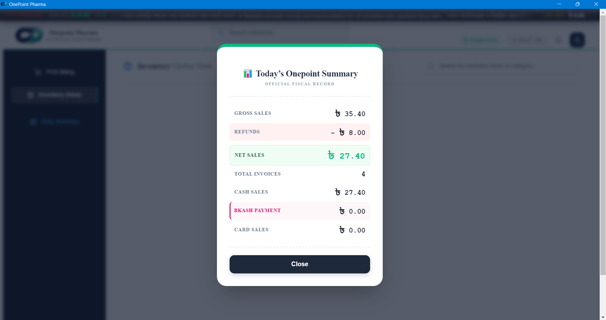
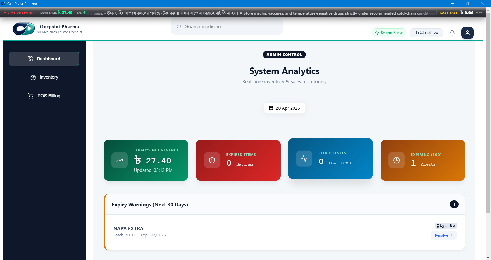

# OnePoint Pharma – Smart Pharmacy POS & Management System

A production-level desktop-based Pharmacy POS system designed to manage billing, inventory, staff, and business operations efficiently.

Built with Electron, React, Node.js, and PostgreSQL for real-world pharmacy workflows.

---

## Overview

OnePoint Pharma is a complete pharmacy management solution that automates billing, stock control, reporting, and multi-role access in a single desktop application.

It is designed for real business environments with high-speed operations and accuracy.

---

## Developer

Jibanur Sarker
Full Stack Developer (PHP | React | Node.js)

---

## System Overview

- Desktop Application (Electron)
- Fast POS Billing System
- Inventory & Stock Management
- Role-Based Dashboard (Admin, Owner, Pharmacist)
- Thermal & PDF Invoice Printing
- Backup & Restore System
- Real-Time Reports & Analytics

---

## Tech Stack

**Frontend:**
- React.js (Vite)
- CSS (Custom UI)

**Backend:**
- Node.js
- Express.js

**Database:**
- PostgreSQL
- Prisma ORM

**Desktop App:**
- Electron.js

---

## Application Screenshots

### Login Interface


---

### POS Billing System


---

### Inventory Management


---

### Owner Dashboard


---

### Thermal Print


---

### Today Summary


---

### Admin Panel


## Key Features

- Barcode-based fast billing
- Automatic stock update after sale
- Low stock alert system
- Role-based secure authentication
- Refund & return system
- Real-time dashboard analytics
- Offline-first desktop support

---

## ⚙️ Installation Guide

```bash
# Clone repository
git clone https://github.com/milons2/onepoint-pharma.git

# Install dependencies
npm install

# Setup database
npx prisma migrate dev
npx prisma db seed

# Run backend
node src/server.js

# Run frontend
cd pos-ui
npm install
npm run dev

# Run Desktop app
npm run electron

# Project Purpose

This system solves real-world pharmacy challenges:

Manual billing errors
Stock mismanagement
Lack of reporting tools
Inefficient sales tracking

# Why This Project Stands Out
Real-world production-level architecture
Multi-role authentication system
Desktop + Web hybrid system
Complete pharmacy workflow automation

# Future Improvements
Cloud synchronization system
Mobile app integration
bKash / Nagad payment integration
Multi-branch support

# Support

If you like this project:
⭐ Star this repository
🚀 Share with others
